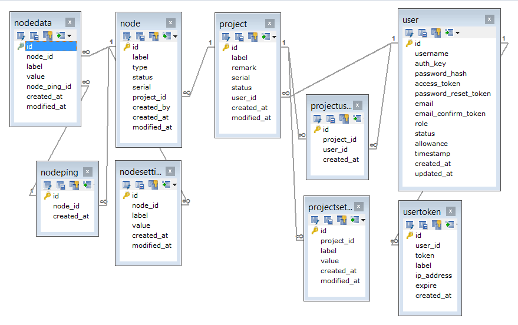

# Smart Bins #

* Server: http://eceiot.np.edu.sg/smart-bins/api/index.php
* IP Address: 128.199.77.122

## Database ##

__List of Key Database Tables__

Table   | Remark
---     | ---
Project    | A crowd monitoring project. Each project may have one or more sensor Nodes.
ProjectSetting | Settings for a project, which may applies to all nodes in the project.
Node | A sensor node which can upload data to server.
NodeData    | Data value of a node, e.g. sensor data. Each record can only keep one piece of data.
NodeSetting | Settings for a node.
NodePing | In case a Node has to send multiple related data to NodeData table, it can create a NodePing record, and use the nodePing ID for all the related data.

---

## Available Web Service ##

__Common Web Service Operations__
Web services are operations for database tables. Basic operations are closely related to database operations. 

Operation   | Remark
---     | ---
List    | List all objects in the table
View    | View an object with its ID
Search  | Search for objects with some conditions
Create  | Create an new object in database
Update  | Update an object identified by ID
Delete  | Delete an object from table
Other Custom Functions  | Customized web service function

### Project ###
> A project may consist of multiple bins to be monitored. Each bin may contain multiple sensor nodes.

#### list ####
> List all projects. Optional to get related projectSettings, nodes, owners and eligible users.

* URL: /v1/project[?expand=[projectSettings][,nodes][,owner][,users]]
* Method: GET
* Access: Anonymous

Example

* http://eceiot.np.edu.sg/smart-bins/api/index.php/v1/project
* http://eceiot.np.edu.sg/smart-bins/api/index.php/v1/project?expand=projectSettings,nodes

#### view ####
> View detail info of a project. Optional to get related nodes, owners and eligible users.

* URL: /v1/project/<id\>[?expand=[projectSettings][,nodes][,owner][,users]]
* Method: GET
* Access: Anonymous

Example

* http://eceiot.np.edu.sg/smart-bins/api/index.php/v1/project/1
* http://eceiot.np.edu.sg/smart-bins/api/index.php/v1/project/1?expand=projectSettings,nodes,owner,users

#### search ####
> Search for projects which fulfils the query condition(s).

* URL: /v1/project/search?<query\>
* Method: GET
* Access: Anonymous

Example: 
    
* http://eceiot.np.edu.sg/smart-bins/api/index.php/v1/project/search?label=ECE%20Recycle%20Bins
    - space must be replace with %20
* http://eceiot.np.edu.sg/smart-bins/api/index.php/v1/project/search?status=1

#### create ####
> Create a new project

* URL: /v1/project
* Method: POST
* Access: Manager
* Data: `{'label': 'Test Recycle Bins'}`

#### update ####
> Update a existing project in database

* URL: /v1/project/<id\>
* Method: PUT
* Access: User
* Data: {'label': 'Test Recycle Bins'}

#### delete ####
> Delete a project

* URL: /v1/project/<id\>
* Method: DELETE
* Access: Manager

---

## ProjectSetting ##
> A project may have multiple settings. These settings may be default settings for all nodes in the project.  

#### list ####

* URL: /v1/project-setting
* Method: GET
* Access: Anonymous

Example

* http://eceiot.np.edu.sg/smart-bins/api/index.php/v1/project-setting

#### view ####

* URL: /v1/project-setting/<id>?expand=node
* Method: GET
* Access: Anonymous

Example

* http://eceiot.np.edu.sg/smart-bins/api/index.php/v1/project-setting/1?expand=project

#### search ####

* URL: /v1/project-setting/search?<query\>
* Method: GET
* Access: Anonymous

Example: 
    
* http://eceiot.np.edu.sg/smart-bins/api/index.php/v1/project-setting/search?label=sleep

#### create ####

* URL: /v1/project-setting
* Method: POST
* Access: Manager
* Data: {'project_id': '1', 'label': 'sleep', 'value': '1'}

#### update ####

* URL: /v1/project-setting/<id\>
* Method: PUT
* Access: User
* Data: {'project_id': '1', 'label': 'sleep', 'value': '1'}

#### delete ####

* URL: /v1/project-setting/<id\>
* Method: DELETE
* Access: Manager

---

## Node ##
> A node is a sensor node which uploads data to server. 

#### list ####

* URL: /v1/nodes
* Method: GET
* Access: Anonymous

Example

* http://eceiot.np.edu.sg/smart-bins/api/index.php/v1/node

#### view ####

* URL: /v1/node/<id>?expand=project,nodeData,nodeSettings
* Method: GET
* Access: Anonymous

Example

* http://eceiot.np.edu.sg/smart-bins/api/index.php/v1/node/1?expand=project,nodeData,nodeSettings

#### search ####

* URL: /v1/nodes/search?<query\>
* Method: GET
* Access: Anonymous

Example: 

* http://eceiot.np.edu.sg/smart-bins/api/index.php/v1/node/search?label=abc

#### create ####

* URL: /v1/nodes
* Method: POST
* Access: Manager
* Data: {'label': 'Bin 9', 'type': 'Type 1', 'project_id': '1'}

#### update ####

* URL: /v1/nodes/<id\>
* Method: PUT
* Access: User
* Data: {'label': 'Bin 9', 'type': 'Type 1', 'project_id': '1'}

#### delete ####

* URL: /v1/nodes/<id\>
* Method: DELETE
* Access: Manager

---

## NodeData ##
> Data uploaded by sensor nodes are stored on server. 

#### list ####

* URL: /v1/node-data
* Method: GET
* Access: Anonymous

Example

* http://eceiot.np.edu.sg/smart-bins/api/index.php/v1/node-data

#### view ####

* URL: /v1/node-data/<id>?expand=node
* Method: GET
* Access: Anonymous

Example

* http://eceiot.np.edu.sg/smart-bins/api/index.php/v1/node-data/5?expand=node

#### search ####

* URL: /v1/node-data/search?<query\>
* Method: GET
* Access: Anonymous

Example: 
    
* http://eceiot.np.edu.sg/smart-bins/api/index.php/v1/node-data/search?label=CrowdNow

#### Latest by Project ####
> Get the latest NodeData of all nodes of a project.

* URL: /v1/node-data/latest-by-project/<projectId\>
* Method: GET
* Access: Anonymous

Example: 
    
* http://eceiot.np.edu.sg/smart-bins/api/index.php/v1/node-data/latest-by-project/1

#### Latest by Project and Label ####
> Get the latest NodeData of all nodes of a project, which matches a label.

* URL: /v1/node-data/latest-by-project-and-label/<projectId\>/<label\>
* Method: GET
* Access: Anonymous

Example: 
    
* http://eceiot.np.edu.sg/smart-bins/api/index.php/v1/node-data/latest-by-project-and-label/1/Temp

#### Latest All Labels by Project ####
> Get the latest record of NodeData of all labels of a project

* URL: /v1/node-data/latest-all-labels-by-project/<projectId\>
* Method: GET
* Access: Anonymous

Example: 
    
* http://eceiot.np.edu.sg/smart-bins/api/index.php/v1/node-data/latest-all-labels-by-project/1

#### Latest All Labels In Days By Project ####
> Get the latest record of NodeData of all labels of a project recorded in past x days

* URL: /v1/node-data/latest-all-labels-in-days-by-project/<projectId\>/<pastDays\>
* Method: GET
* Access: Anonymous

Example: 
    
* http://eceiot.np.edu.sg/smart-bins/api/index.php/v1/node-data/latest-all-labels-in-days-by-project/1/30

#### create ####

* URL: /v1/node-data
* Method: POST
* Access: Manager
* Data: {'node_id': '1', 'label': 'temp', 'value': '8.88'}

#### update ####

* URL: /v1/node-data/<id\>
* Method: PUT
* Access: User
* Data: {'node_id': '1', 'label': 'temp', 'value': '8.88'}

#### delete ####

* URL: /v1/node-data/<id\>
* Method: DELETE
* Access: Manager

---

## NodeSetting ##
> A node may have multiple settings. Each setting and corresponding value is kept in the NodeSetting table.  

#### list ####

* URL: /v1/node-setting
* Method: GET
* Access: Anonymous

Example

* http://eceiot.np.edu.sg/smart-bins/api/index.php/v1/node-setting

#### view ####

* URL: /v1/node-setting/<id>?expand=node
* Method: GET
* Access: Anonymous

Example

* http://eceiot.np.edu.sg/smart-bins/api/index.php/v1/node-setting/1?expand=node

#### search ####

* URL: /v1/node-setting/search?<query\>
* Method: GET
* Access: Anonymous

Example: 
    
* http://eceiot.np.edu.sg/smart-bins/api/index.php/v1/node-setting/search?label=sleep

#### create ####

* URL: /v1/node-setting
* Method: POST
* Access: Manager
* Data: {'node_id': '1', 'label': 'sleep', 'value': '1'}

#### update ####

* URL: /v1/node-setting/<id\>
* Method: PUT
* Access: User
* Data: {'node_id': '1', 'label': 'sleep', 'value': '1'}

#### delete ####

* URL: /v1/node-setting/<id\>
* Method: DELETE
* Access: Manager

---

## NodePing ##
> A node may submit a few related data to server. But each record in NodeData table can only store 1 value. To cluster these data together, a NodePing value may be assigned to all these records to maintain their relationship. 

#### list ####

* URL: /v1/node-ping
* Method: GET
* Access: Anonymous

Example

* http://eceiot.np.edu.sg/smart-bins/api/index.php/v1/node-ping

#### view ####

* URL: /v1/node-ping/<id>?expand=node,nodeData
* Method: GET
* Access: Anonymous

Example

* http://eceiot.np.edu.sg/smart-bins/api/index.php/v1/node-ping/1?expand=node,nodeData

#### search ####

* URL: /v1/node-ping/search?<query\>
* Method: GET
* Access: Anonymous

Example: 
    
* http://eceiot.np.edu.sg/smart-bins/api/index.php/v1/node-ping/search?nodeId=1

#### create ####

* URL: /v1/node-ping
* Method: POST
* Access: Manager
* Data: {'node_id': '1'}

#### delete ####

* URL: /v1/node-ping/<id\>
* Method: DELETE
* Access: Manager

